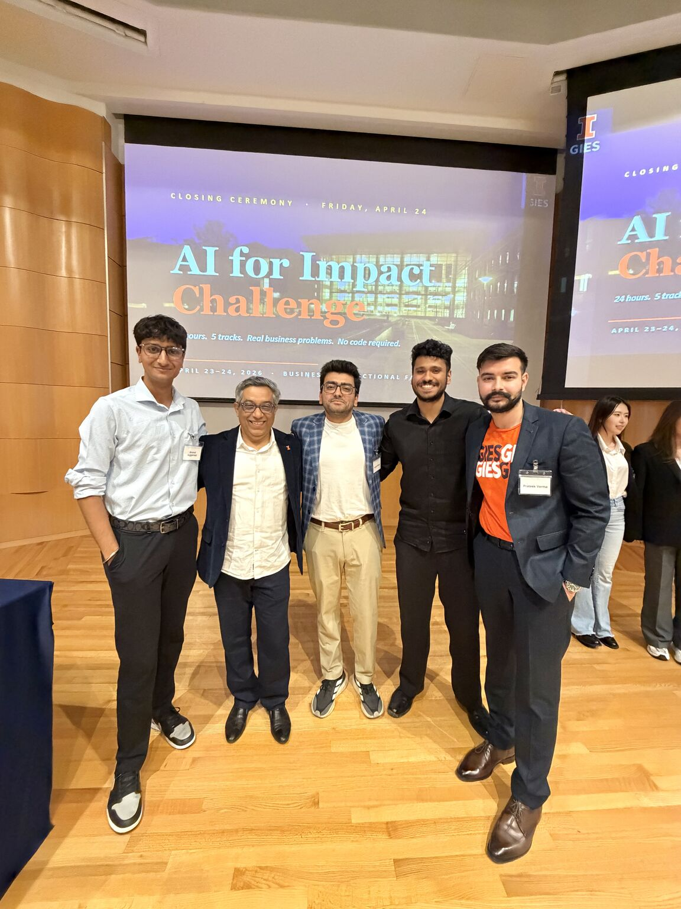
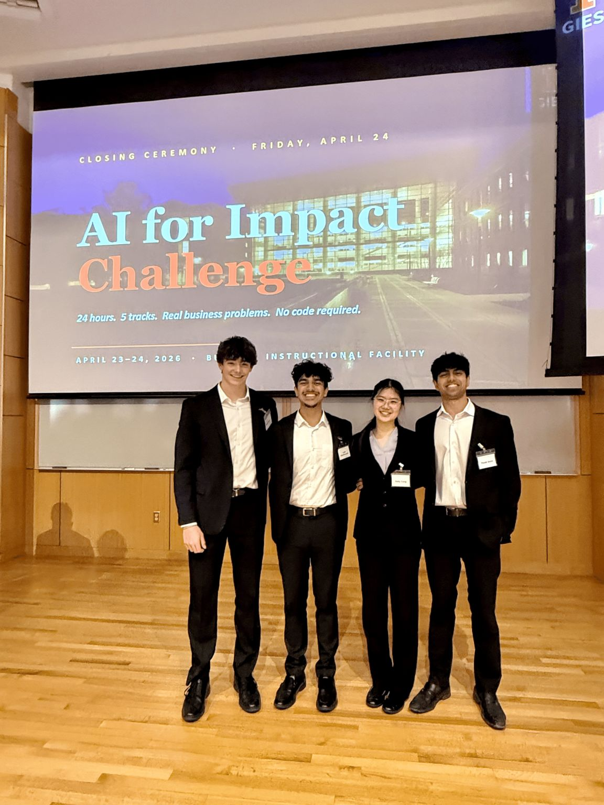
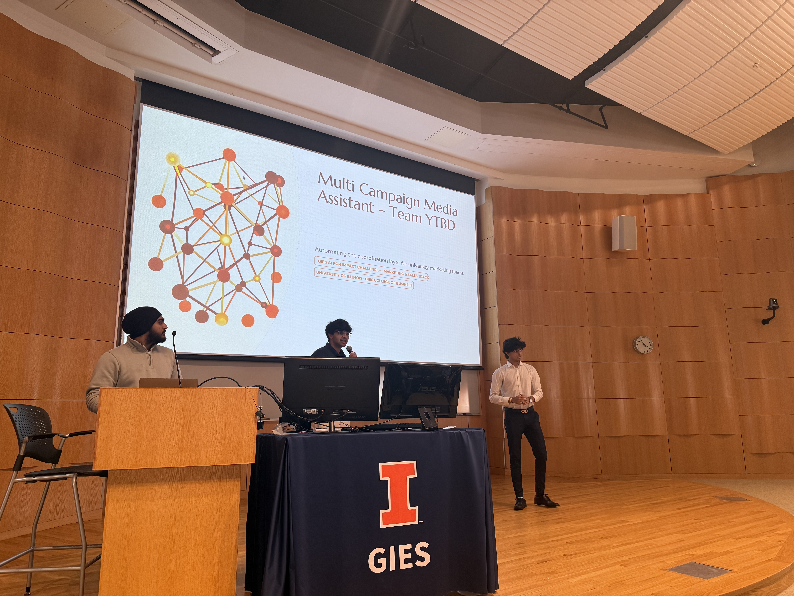
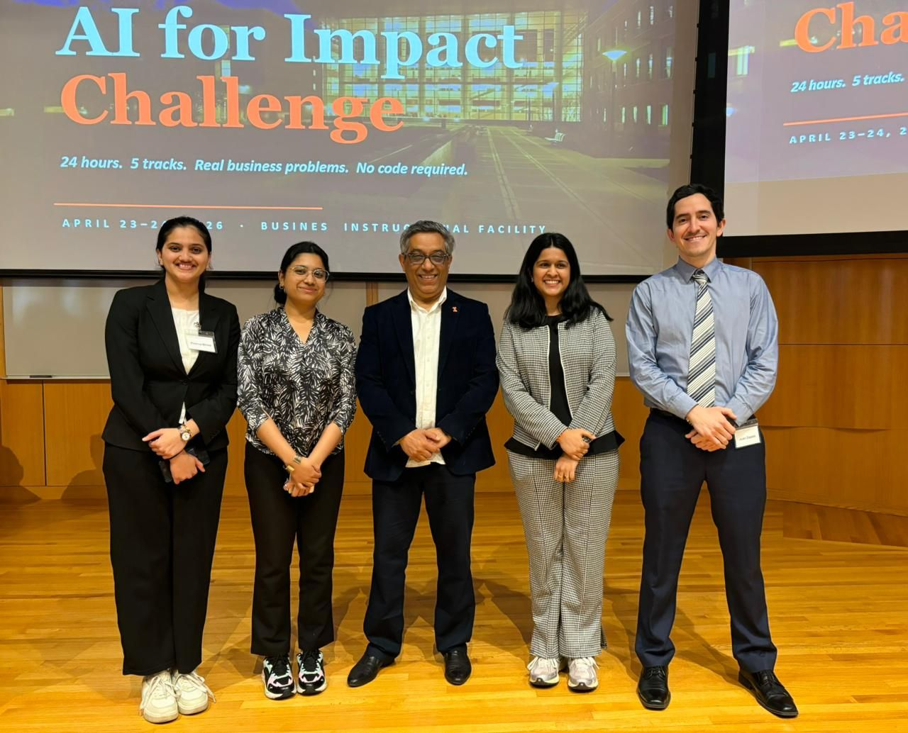
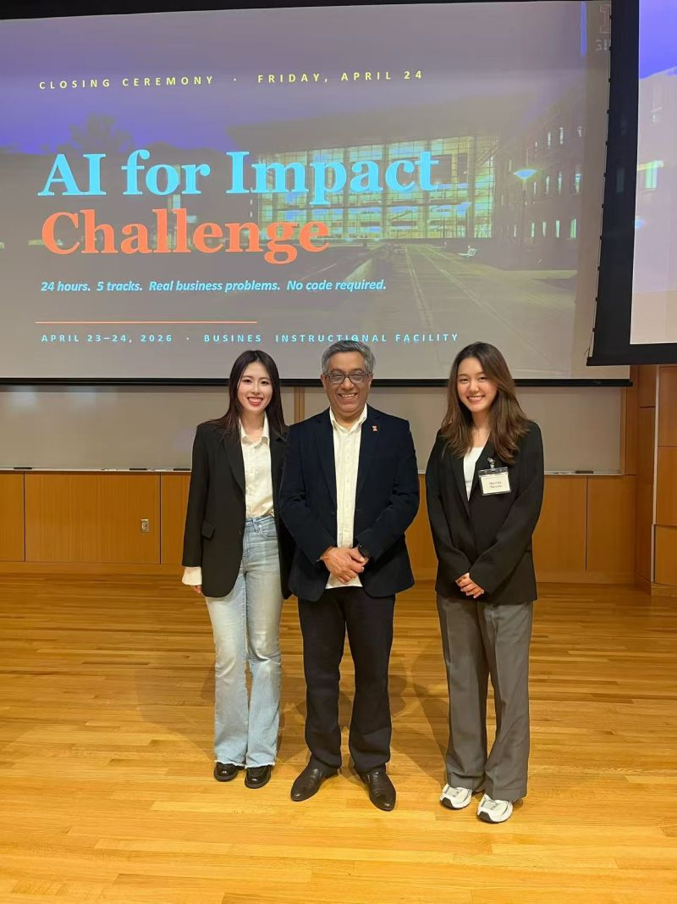

# Build to Learn, Learn to Build

### A 24-Hour Story of What Gies Students Can Ship

*Spring 2026 · Gies College of Business · University of Illinois Urbana-Champaign*

*Prepared for college leadership, project champions, mentors, judges, the keynote partner, the Office of the Provost, and prospective future sponsors.*

---

## The Premise

In late 2025, AI fluency emerged as the single most-cited capability employers said they couldn't find. The labor market signals were unambiguous: the analytics roles where Gies graduates land are the rare segment of the U.S. economy that *grows* as AI becomes cheaper. The roles many of our students are pivoting *from* — marketing operations, project management, non-analytics finance — are the ones AI is reshaping fastest.

The honest question facing us was not whether Gies should integrate AI. It was whether our students would graduate as people who *build with* AI, or as people who merely *know about* it.

The Gies AI for Impact Build-A-Thon was an answer to that question, in 24 hours.

---

## The Event

On April 23, 2026, [Paul Hsu](https://www.linkedin.com/in/paulhsu/) and [Abdul Al Ali](https://www.linkedin.com/in/abdalali/) of [Decasonic](https://www.linkedin.com/company/decasonic/) walked onto the Deloitte Auditorium stage in the Business Instructional Facility and described what their venture firm looks like when 220 AI teammates work alongside the humans across sourcing, diligence, research, and portfolio operations. The room was full of Gies students who had spent the previous three weeks in five preparatory workshops on design thinking, no-code AI platforms, agent fundamentals, demo storytelling, and multi-agent orchestration. Two hundred students had RSVP'd to those workshops. One hundred and twenty registered for the build itself.

Twenty-four hours later, **22 teams comprising 72 students** walked out with working agentic systems built on [Microsoft Copilot Studio](https://www.microsoft.com/en-us/microsoft-copilot/microsoft-copilot-studio). The platform recorded its **largest single-day usage at UIUC on record**.

This was not a hackathon in the classical sense. Each of the five tracks was anchored by a real Gies operating leader who had submitted a real, currently unsolved business problem — complete with sample data, scoring rubrics, and the expectation that whatever students built would be useful afterward.

---

## The Champions and the Problems

Five Gies leaders gave students problems they actually needed solved.

**[Charlie Farhoodi](https://www.linkedin.com/in/charliefarhoodi/)** and **[Ken Magrow](https://www.linkedin.com/in/kenmagrow/)** at the Magelli Office of Experiential Learning source 200+ consulting clients each semester through relationships and referrals. Public job postings contain signals — "first marketing hire," "Director of Revenue Operations" — that map to consulting opportunities the Office would otherwise never know about. Their challenge: build an agent that decodes those signals continuously.

**[Adam King](https://www.linkedin.com/in/king-adam/)** from Gies Innovation & Transformation asked students to think like a CFO making capital reallocation decisions: every month, which innovation projects to stop, which to scale, where to redeploy freed capital. The current process is manual, subjective, and slow.

**[Julia Shubina Sabin](https://www.linkedin.com/in/juliasabin/)** brought a hiring problem: how do you eliminate scoring drift in candidate evaluation when different reviewers use different mental rubrics? Build a multi-agent system that scores against a defined rubric, ingests interview transcripts, and produces an auditable hiring recommendation.

**[Lindsey Savoie Halfar](https://www.linkedin.com/in/savoie/)** in Gies Marcom runs multiple paid media campaigns simultaneously — each with its own budget, timeline, channels, and creative requirements. Her challenge: unify intake, asset coordination, performance tracking, and stakeholder reporting into one orchestrated workflow.

**[Skylar Zhang](https://www.linkedin.com/in/skylar-zhang/)** and **[Amber Glynn](https://www.linkedin.com/in/amber-glynn-425271180/)** sponsored the General Innovation track — the Career Navigator challenge — around something every MSBA student lives: the bewilderment of career navigation when applying broadly, unsure which roles fit, what skills matter, where to focus. The challenge was to turn a student profile into personalized career recommendations, skill gap insights, and a tailored job-search roadmap.

These challenges came with rubrics that rivaled production specifications. The Business Technology rubric, for example, required scores reproducible within ±6 points across reviewers, formulas with explicit weights, fairness rules forbidding the use of "company name prestige or personal networks as inputs," and audit trails for every decision. Students were not given toy problems. They were given the kind of work the Office of Experiential Learning, the CFO's office, HR, Marcom, and the MSBA program would otherwise pay external vendors to do.

More Gies leaders submitted strong challenges than we could feature in a single 24-hour event — including **Andrew Allen**, **Ravi Mehta**, and **Martin Maurer**. Those submissions shaped the rubric design and the event's scope, and they're a clear signal that the appetite for student-built AI inside Gies is larger than one Build-A-Thon can absorb. They form the backlog for the next iteration.

---

## What They Built

Twenty-two teams. Five tracks. Five winners — one per track — who together formed the Top 5 overall.

### 🥇 Team 007 · *Magelli Scout* · 1st place overall

Lead: [Prateek Verma](https://www.linkedin.com/feed/update/urn:li:activity:7453787041286361088/) · [Anmol Aggarwal](https://www.linkedin.com/in/anmol-aggarwal3101/) · [Jeswell Mathew](https://www.linkedin.com/in/jeswellmathew/) · [Venkatesh Mehra](https://www.linkedin.com/in/venkatesh-mehra/)
Champions: [Charlie Farhoodi](https://www.linkedin.com/in/charliefarhoodi/) · [Ken Magrow](https://www.linkedin.com/in/kenmagrow/)

> "Every job posting is a company publicly broadcasting what they can't do. A 'Director of Revenue Operations' posting doesn't just mean they're hiring — it means they have no revenue process today. That's a consulting brief hiding in plain sight." — [Prateek Verma](https://www.linkedin.com/feed/update/urn:li:activity:7453787041286361088/)

Magelli Scout reads job postings backwards. It scores them against a fairness-audited rubric, identifies first-strategic-hire signals and cluster-hiring patterns, and delivers ranked consulting briefs to Magelli staff before anyone has to open a laptop. Power BI shows where to go. Power Automate delivers the brief. **Magelli Scout is live.**

### 🥈 Team Geese · *HireFlow* · 2nd place overall, HR track winner

Lead: [Purab Arora](https://www.linkedin.com/feed/update/urn:li:activity:7454589500653088768/) · Mitchell Crevier · Luke Manthuruthil · Kelly Cong
Champion: [Julia Shubina Sabin](https://www.linkedin.com/in/juliasabin/)

> "Every time one of us hit a wall, someone else picked it up — that's how HireFlow got built. 1,440 minutes. Straight grind." — [Purab Arora](https://www.linkedin.com/feed/update/urn:li:activity:7454589500653088768/)

A multi-agent hiring evaluation system that eliminates scoring drift. The hiring manager defines a custom rubric; the agent scores resumes and CVs against levels of responsibility, ingests interview transcripts, scores candidates against historical admission data, and aggregates rounds into one auditable decision. Power Automate logs every step into Excel for the hiring committee.

### 🥉 Team YTBD · 3rd place overall, Marketing & Sales track winner

Lead: Arrush · Abhiraj Singh · Siddh Gandhi
Champion: [Lindsey Savoie Halfar](https://www.linkedin.com/in/savoie/)

The Marketing & Sales track winner, built on Microsoft Copilot Studio against the Multi-Campaign Paid Media Management challenge.

### 4️⃣ Team MindMatrix · *Multi-Agent Career Guidance System* · 4th place overall, General Innovation track winner

Lead: Poorva Bhide · [Juan Carlos Zapata](https://www.linkedin.com/feed/update/urn:li:activity:7454367874472673281/) · Yukta Mehta · Nandini Agarwal
Champions: [Skylar Zhang](https://www.linkedin.com/in/skylar-zhang/) · [Amber Glynn](https://www.linkedin.com/in/amber-glynn-425271180/)

> "Multi-agent systems aren't the future — they're already reshaping how decisions get made." — [Juan Carlos Zapata](https://www.linkedin.com/feed/update/urn:li:activity:7454367874472673281/)

A four-agent system that transforms a student's profile into personalized career recommendations, skill gap insights with targeted learning plans, and a tailored job-search roadmap — including visa-aware guidance for international students.

### 5️⃣ Team HerLedger · *EVA* · 5th place overall, Finance & Accounting track winner

Lead: [Xinying Fu](https://www.linkedin.com/feed/update/urn:li:activity:7454707907176206336/) · Narinda Tanvilai
Champion: [Adam King](https://www.linkedin.com/in/king-adam/)

> "Under 24 hours, we built something that thinks like a CFO and moves faster than one." — [Xinying Fu](https://www.linkedin.com/feed/update/urn:li:activity:7454707907176206336/)

EVA evaluates innovation projects across four dimensions — Strategic Alignment, Spend Efficiency, Milestone Adherence, Signal Strength — and applies covenant-style override rules so severe budget or milestone issues are flagged immediately. Instead of one rigid recommendation, EVA frames freed capital across three strategic options: Protect Near-Term Returns, Repair Portfolio Balance, Bet on Strongest Signals. A four-hour manual review becomes a two-minute automated workflow.

---

## What Happened in the Room

The point of an event like this isn't only the systems that ship. It's the way students describe themselves afterward.

> *"AI is becoming non-negotiable in work and daily life, but the real value does not come from using it for the sake of it. It comes from understanding the problem clearly, asking the right questions, giving the right prompts, and knowing how to verify the output. AI is powerful, but it is not the thinking. If your understanding of the problem is vague, AI will only scale that vagueness."* — [**Glory Cheng**, Team BuildForce](https://www.linkedin.com/feed/update/urn:li:ugcPost:7456805167347286017/)

> *"It was an environment where business and technology truly aligned, where strategy and execution were not separate conversations but one."* — [**Zryan I. Ahmed**, Team BuildForce](https://www.linkedin.com/feed/update/urn:li:ugcPost:7456834759680348160/)

> *"24 hours, no code — we built a campaign manager that actually manages campaigns."* — [**Harvin Patel**, Team Market Matrix](https://www.linkedin.com/feed/update/urn:li:activity:7454630967438336000/)

The mentors and judges saw the same thing from the other side of the table.

[**Paul Hsu**](https://www.linkedin.com/in/paulhsu/), keynote and founder of Decasonic, [reflected publicly](https://www.linkedin.com/feed/update/urn:li:activity:7454163584227573760/) after the event:

> *"Build to Learn. Learn to Build. Experimental learning is thriving at Illinois. … Clear from the conversations with students, faculty, and organizers that this was more than a typical hackathon. It was a focused effort to translate emerging ideas in agentic AI into real, working systems that had impact on the university and broadly the world. … What really stood out to me was the mindset of the student teams: an energy toward building, experimentation, and iteration. I was impressed by the level of engagement, engineering rigor and the emphasis on building real solutions. … Higher education transforms students when it is aligned with applied research and hands-on building, especially in fields that are actively shaping industry innovation. The key skills of tomorrow are imagination, invention and execution."*

[**Sid Chakravarty**](https://www.linkedin.com/in/sidharthachakravarty/), judge — VP, Performance Insights (Advanced Analytics) at Synchrony:

> *"I was truly impressed by the depth of research each team conducted to decompose complex problem statements into multi-agent systems — designing agents that could effectively coordinate to achieve a shared objective. As AI matures, the role of the AI engineer is evolving into that of an Orchestrator. Success will belong to those who maintain an end-to-end view of the system, treating individual components like Lego blocks to be assembled with precision. For large, established firms, the goal is clear: we must cultivate the next generation of AI Orchestrators."* ([source](https://www.linkedin.com/feed/update/urn:li:ugcPost:7453796119290990592/))

[**Jake Myers**](https://www.linkedin.com/in/jake-myers/), mentor from the UIUC Office of the CIO:

> *"In under 24 hours, students built working AI agents that tackled real problems. Most weren't 'AI experts' going in. Just some training, curiosity, very little sleep, and a lot of caffeine. The pace of learning and execution was honestly kind of wild. The barrier to building useful AI solutions is dropping fast. It's less about deep specialization and more about framing the right problem and actually putting something together that works."* ([source](https://www.linkedin.com/feed/update/urn:li:ugcPost:7453771636077592576/))

Jake's post ended with a sentence that, for an event like this, is the highest possible signal of impact:

> *"The Office of the CIO is looking to bring a few of these builders into my AI Solutions Development team to keep working on their ideas over the summer and into next semester — taking what started as a weekend sprint and turning it into something that actually sticks and makes an impact across the university."*

A weekend sprint became a hiring pipeline.

### What Students Told Us Privately

A handful of students went public on LinkedIn. To hear from the rest, we ran a post-event survey. Fourteen students have responded so far — a representative cross-section of the 72 finishers (9 graduate, 5 undergraduate, spanning Finance, Accountancy, Marketing, Information Systems, MSBA, MS Tech Mgmt, and MSF) — with the window still open.

The headline numbers:

- **9.0 / 10** average likelihood to recommend a future event to another student
- **85%** better understand how AI agents support real business workflows
- **85%** better understand how to identify a business process that's a good fit for automation
- **78%** feel more prepared to use AI tools in internships, jobs, coursework, or student-organization work
- **78%** better understand responsible AI — data privacy, transparency, human review
- **71%** gained practical experience using no-code or low-code AI tools

Some of what they said (anonymized; quoted with permission):

> *"The most valuable part was the constraint itself. Twenty-four hours forces you to make real decisions fast, and that pressure taught me more about product thinking than most semester-long projects."* — Graduate student, MSBA

> *"This event gives students something a classroom rarely does — the experience of building something real under pressure and seeing if it actually works. That gap between knowing and doing is where most learning happens. Keep investing in it."* — Graduate student, MSBA

> *"That you actually don't need to know how to code for buildathons like these."* — Undergraduate, Finance (answering what they learned that they didn't know going in)

### What We'll Change

Three honest critiques surfaced in the same survey, and they will shape iteration #2:

1. **Overnight mentor coverage.** Mentors were available in workshops and during daytime hours, but several students noted that overnight — exactly when many teams were debugging and shipping — there was no one to ask. A paged overnight rotation, or a sharper handoff before mentors sign off, fixes this.
2. **Foundational onboarding for newcomers.** The five preparatory workshops covered design thinking, no-code platforms, agent fundamentals, presentation craft, and multi-agent orchestration. They did not include a foundational "how Copilot Studio actually works" walkthrough that students with no prior exposure could ride into the build. Several respondents asked for exactly that.
3. **Format and start time.** Several participants — including some who rated the event highly — argued for an early-morning start instead of overnight, so teams come into the build with full energy rather than burning out late.

Two of fourteen rated overall organization "Fair" and one rated mentor support "Poor." Those rows were read in full, not averaged away. That is the form of feedback an iteration needs.

---

## How It Held Together

Twenty-four hours is short. The reason 22 of 30 teams completed end-to-end was not stamina; it was infrastructure.

Two hundred students RSVP'd to the five preparatory workshops on design thinking, no-code AI platforms, agent fundamentals, presentation craft, and multi-agent orchestration. By the time the build began, students could skip past "where do I start?" and go straight into building. During the event, more than 50 support tickets opened on Discord. **HackClaw**, an AI helpdesk built specifically for the event, fielded 100+ student messages on Discord and sent 500+ emails over the 24 hours — answering common questions, routing requests to mentors, and learning from resolved tickets in real time. HackClaw was itself an [AgentLab project](https://agentlab.illinihunt.org/projects.html). It was the live demonstration that AI agents work best when they're shaped around real moments of work.

Five champions. Seven mentors. Four judges. Three student leaders. The collaborative load was distributed deliberately so that no single person was the bottleneck.

---

## Strategic Alignment

The Build-A-Thon ran the same week Gies launched its new fully online **MSBAi (Master of Science in Business Analytics with AI)** degree, anchored on the same pedagogical thesis: **Build to Learn, Learn to Build.**

In her [launch post](https://www.linkedin.com/feed/update/urn:li:activity:7456092663075983360/), Dean [**W. Brooke Elliott**](https://www.linkedin.com/in/w-brooke-elliott-4a46634/) wrote:

> *"Our world-class domain experts will teach people AI's strengths and weaknesses well enough to orchestrate it using our Build to Learn, Learn to Build experiential learning approach."*

The Build-A-Thon is not separate from the MSBAi degree. It is the degree's thesis demonstrated in 24 hours: that business students who build with AI on real Gies problems learn AI faster, and learn business deeper, than students who only study it.

This positioning ladders up to Gies College's purpose statement, adopted in May 2026: *"Creating life-changing access to purposeful business education and thought leadership that shapes a better world."* Both the Build-A-Thon and the MSBAi degree are direct expressions of that purpose. The 24-hour event provided life-changing access — to a tool stack, to operating-leader problems, and to the experience of shipping production-grade AI under real constraints. The career pivoter thesis underneath MSBAi is the same one underneath the Build-A-Thon: meet the moment in front of us with people who can think clearly and build deliberately.

---

## What This Generated, Beyond the 24 Hours

- **Magelli Scout is in production** at the Magelli Office of Experiential Learning, automating consulting prospect identification.
- **Track champions retain working systems** built against their own operational problems — across Finance, HR, Marketing, and General Innovation.
- **The UIUC Office of the CIO is recruiting builders** from this event onto its AI Solutions Development team for summer and fall — turning a weekend sprint into university-wide AI work. ([source](https://www.linkedin.com/feed/update/urn:li:ugcPost:7453771636077592576/))
- **The event surfaced a Gies-[Decasonic](https://www.linkedin.com/company/decasonic/) relationship** with [Paul Hsu](https://www.linkedin.com/in/paulhsu/) and [Abdul Al Ali](https://www.linkedin.com/in/abdalali/), both of whom continued public engagement with students after the event. Paul's [post-event reflection](https://www.linkedin.com/feed/update/urn:li:activity:7454163584227573760/) — *"this was more than a typical hackathon"* — drew 113+ reactions and 5 reposts, validating the event publicly to an external industry audience.
- **External visibility on LinkedIn** generated 391+ reactions, 86+ comments, and 10+ reposts on student write-ups alone — read by recruiters, faculty, alumni, and prospective students who saw what Gies students can do. Vishal's [kickoff post](https://www.linkedin.com/feed/update/urn:li:ugcPost:7453222023301922817/) names the full event team.

---

## Looking Forward

The model proved itself: real problems contributed by real operating leaders, scoped tightly, supported with rigorous infrastructure, and judged with rigor. Three threads to build on.

**More champions, more challenges.** Five tracks barely scratched the surface of operational problems within Gies and partner offices. Future iterations can add tracks (Operations, Risk, Student Success, Research) with new champions, and can extend invitations to other UIUC colleges.

**A persistent pipeline.** Top builders are being absorbed by the Office of the CIO's AI Solutions Development team. This pipeline can be formalized so every Build-A-Thon graduates 5–10 students directly into university-wide AI work — and into MSBAi as a continued path of study.

**External sponsorship.** The combination of named-champion problems, a working Microsoft Copilot Studio partnership, keynote-level industry presence (Decasonic), and demonstrated student execution makes this an attractive sponsorship venue. Future sponsors can be named for individual tracks, prizes, or the keynote slot.

The Build-A-Thon is what experiential AI education looks like when business and technology are not separate conversations.

> *"Build to Learn. Learn to Build."*

---

## Acknowledgements

**Keynote**
[Paul Hsu](https://www.linkedin.com/in/paulhsu/) · [Abdul Al Ali](https://www.linkedin.com/in/abdalali/) — *[Decasonic](https://www.linkedin.com/company/decasonic/)*

**Project Champions**
[Charlie Farhoodi](https://www.linkedin.com/in/charliefarhoodi/) · [Ken Magrow](https://www.linkedin.com/in/kenmagrow/) · [Adam King](https://www.linkedin.com/in/king-adam/) · [Skylar Zhang](https://www.linkedin.com/in/skylar-zhang/) · [Amber Glynn](https://www.linkedin.com/in/amber-glynn-425271180/) · [Julia Shubina Sabin](https://www.linkedin.com/in/juliasabin/) · [Lindsey Savoie Halfar](https://www.linkedin.com/in/savoie/)

**Judges**
[Jacob Kinsey](https://www.linkedin.com/in/jacobkinsey/) (Senior Director, Illinois Ventures) · [Sid Chakravarty](https://www.linkedin.com/in/sidharthachakravarty/) (VP, Performance Insights — Advanced Analytics, Synchrony) · [Tarkan Bolat](https://www.linkedin.com/in/tarkanbolat/) (Senior Consultant, KPMG Ignition) · [Mark Moran](https://www.linkedin.com/in/moranmarkd/) (VP, Data, Systems & Intelligence — Plant Biotech, Bayer)

**Mentors**
[Lindsey Savoie Halfar](https://www.linkedin.com/in/savoie/) · [Amber Glynn](https://www.linkedin.com/in/amber-glynn-425271180/) · [Skylar Zhang](https://www.linkedin.com/in/skylar-zhang/) · [Jake Myers](https://www.linkedin.com/in/jake-myers/) · [Jamie Nelson](https://www.linkedin.com/in/wickedthirteen/) · [Charlie Farhoodi](https://www.linkedin.com/in/charliefarhoodi/) · [Julia Shubina Sabin](https://www.linkedin.com/in/juliasabin/)

**Student Leaders**
[Ashleyn Castelino](https://www.linkedin.com/in/ashleyn-castelino/) · [Keshav Dalmia](https://www.linkedin.com/in/keshav-dalmia/) · [Sahib Bedi](https://www.linkedin.com/in/sahibpreet-bedi/)

**Behind-the-Scenes Support**
[Jeremy Samuel](https://www.linkedin.com/in/jeremy-samuel-col323/) · [Shikhar Mattoo](https://www.linkedin.com/in/shikhar-mattoo/) · [Shreyas Kulkarni](https://www.linkedin.com/in/shreyaskulkarni29/)

**Faculty & Staff Leadership**
[Adam King](https://www.linkedin.com/in/king-adam/) · [Jamie Nelson](https://www.linkedin.com/in/wickedthirteen/) · [Chris Tidrick](https://www.linkedin.com/in/christophertidrick/) · [Matias Carrasco Kind](https://www.linkedin.com/in/matiasck/) · [Jake Myers](https://www.linkedin.com/in/jake-myers/) · [Vishal Sachdev](https://www.linkedin.com/in/vishalsachdev/)

**Additional Challenge Submissions** Andrew Allen · Ravi Mehta · Martin Maurer

**Sponsoring Organizations**
[Gies College of Business](https://www.linkedin.com/company/giesbusiness/) · [Agentic AI @ UIUC](https://one.illinois.edu/agenticai/home/) · [Gies Disruption Lab](https://giesbusiness.illinois.edu/disruption-lab) · BuildIllinois · [Magelli Office of Experiential Learning](https://giesbusiness.illinois.edu/experience/experiential-learning) · [Data Science Research Services — Gies College of Business](https://dsrs.illinois.edu/)

**The 22 Teams Who Finished**
007 · Bob the Builders · BuildForce · ByteCrawl · Catalyst · Colabs · Condescending · Geese · Gies Intelligence · HanuMind · HerLedger · Interstellar · JKR · LogicRay · Market Matrix · MindMatrix · Monkes Never Cramp · S.M.B · Team Beta · Uncharted · Winners · YTBD

— and the 72 Gies students who built them.

---

*Event details: https://build-a-thon.dsrs.illinois.edu/ · Final results: https://ikompete.dsrs.illinois.edu/competition/14*
